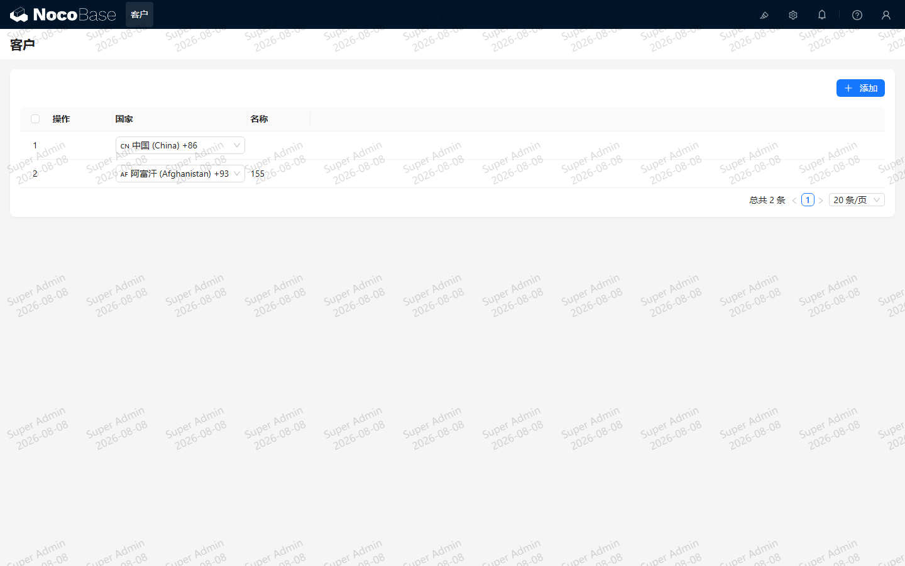

# nocobase-plugin-watermark（水印插件）

NocoBase 全局水印插件：用户登录成功后，在整个页面上覆盖半透明水印，显示**当前登录用户名和当天日期**，防止截图泄密。支持 v1（`/admin/`）与 v2（`/v/admin/`）两个界面，均可用。



## 功能特性

| 需求 | 实现 |
| --- | --- |
| 登录后显示水印 | 监听 `auth:tokenChanged`，登录成功立即在页面覆盖半透明水印（用户名 + 日期），`pointer-events: none` 不干扰任何操作 |
| 公共页面 / 未登录 / 登出后不显示 | 登录页、注册页（`/signin`、`/signup`、`/forgot-password`、`/reset-password`）及未登录状态自动移除水印 DOM；定时检测保证 **30s 内生效** |
| 防止删除水印 DOM | `MutationObserver` 监听水印节点，被删除后**立即重建**；另有 5s 定时健康检查，样式被篡改（如改透明度、移背景）也会自动恢复 |
| 可配置项 | 水印文字（支持占位符、多行换行）、透明度、字号、排列密度（稀疏/中等/密集） |
| 启用水印总开关 | 关闭后立即移除水印 DOM，配置保留不丢失，重新开启即恢复 |
| 双界面支持 | v1（`/admin/`）与 v2（`/v/admin/`）客户端同时生效，共用同一套运行时逻辑 |

## 兼容性

- NocoBase `2.1.x`（在 2.1.34 上开发验证）
- 数据库无关（配置表 `watermarkSettings` 为普通单例表）
- 支持 v1 与 v2 客户端，无需额外配置

## 安装

### 方式一：插件管理器上传（推荐，适用于 Docker / 已有实例）

1. 在插件源码目录执行 `npm pack` 生成安装包：

   ```bash
   npm pack
   # 生成 nocobase-plugin-watermark-1.0.0.tgz
   ```

2. 登录后台 → 插件管理器（v1：`/admin/settings/plugin-manager`；v2：`/v/admin/settings/plugin-manager`）→ 点击「安装插件」/「Upload」→ 选择 `.tgz` 上传 → 在列表中找到 **水印 (Watermark)** → 启用。

### 方式二：源码安装（开发环境 / monorepo）

```bash
# 1. 将插件目录放到应用的 packages/plugins/ 下
cp -r nocobase-plugin-watermark <app>/packages/plugins/

# 2. 构建并启用（在应用根目录执行）
cd <app>
yarn build nocobase-plugin-watermark
yarn pm enable nocobase-plugin-watermark

# 3. 重启应用
yarn start
```

### 方式三：Docker 容器

- 把 `.tgz` 拷入容器后通过插件管理器上传安装；或
- 把源码目录挂载/拷贝到镜像的 `packages/plugins/` 下，构建并启用（同方式二）。

插件不依赖任何本机绝对路径，可在容器内直接运行。

## 配置

后台 → 设置 → **水印**（`/admin/settings/watermark`，v2 为 `/v/admin/settings/watermark`）：

| 配置项 | 说明 | 默认值 |
| --- | --- | --- |
| 启用水印 | 总开关，关闭后水印立即移除，配置保留 | 开 |
| 水印文字 | 支持占位符与多行换行（见下表），默认用户名与日期各占一行 | `{{user}}\n{{date}}` |
| 透明度 | 滑动条调节，0.05 ~ 1（下方实时显示当前值） | 0.15 |
| 字号 | 8 ~ 64 px | 16 |
| 排列密度 | 稀疏 / 中等 / 密集 | 中等 |

### 水印文字占位符

| 占位符 | 说明 | 示例 |
| --- | --- | --- |
| `{{user}}` / `{user}` | 当前登录用户名（昵称优先，其次用户名、邮箱） | `Super Admin` |
| `{{date}}` / `{date}` | 当天日期（本地时区，`yyyy-MM-dd`） | `2026-08-05` |

水印文字支持多行排版：按换行符分行显示（如用户名与日期各占一行）；文字宽度随内容自适应，不被截断。排列密度通过平铺单元间距控制。

## 权限

- 配置读取接口 `watermarkSettings:get`：所有已登录用户可访问（客户端渲染水印需要）
- 配置保存接口 `watermarkSettings:put`：仅管理员（ACL snippet：`pm.watermark.settings`）
- 设置页菜单对无权限角色自动隐藏

## 技术实现

- **纯 DOM 渲染**：水印为 `position: fixed` 全屏层（`z-index: 99999`、`pointer-events: none`），背景为旋转 -25° 的 SVG data-URI 平铺，无 React Provider、无额外依赖
- **事件驱动**：`auth:tokenChanged`（登录/登出即时响应）、路由变化订阅（进入登录页即时移除）、`nocobase-plugin-watermark:settingsChanged`（设置保存后即时刷新）
- **定时兜底**：5s 周期健康检查（节点缺失/样式篡改 → 重建；登出/公共页 → 30s 内移除），30s 设置缓存自动拉取最新配置（多标签页同步）
- **服务端**：`watermarkSettings` 单例表 + 自定义 `get/put` action（参考官方 `plugin-system-settings` 模式），配置随备份保留（`dumpRules: required`）

## 目录结构

```
nocobase-plugin-watermark/
├── src/
│   ├── server/            # 服务端：集合定义 + get/put action + ACL
│   │   └── collections/watermarkSettings.ts
│   ├── client/            # v1 客户端（/admin/）
│   │   ├── plugin.tsx
│   │   └── pages/WatermarkSettingsPage.tsx
│   ├── client-v2/         # v2 客户端（/v/admin/）
│   │   ├── plugin.tsx
│   │   └── pages/WatermarkSettingsPage.tsx
│   ├── shared/            # 共享逻辑（v1/v2 共用）
│   │   ├── watermark.ts            # WatermarkManager 水印运行时
│   │   └── WatermarkSettingsForm.tsx  # 设置页表单
│   └── locale/            # zh-CN / en-US
├── dist/                  # 构建产物
├── package.json
└── README.md
```

## 开发调试

```bash
# 构建（server + client + client-v2 三个 lane）
yarn build nocobase-plugin-watermark

# 启用 / 禁用
yarn pm enable nocobase-plugin-watermark
yarn pm disable nocobase-plugin-watermark
```

## License

MIT
